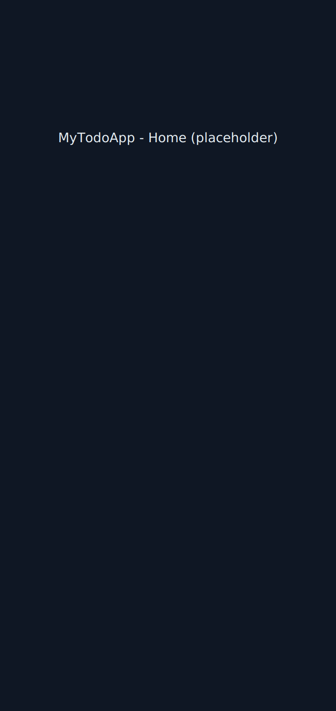
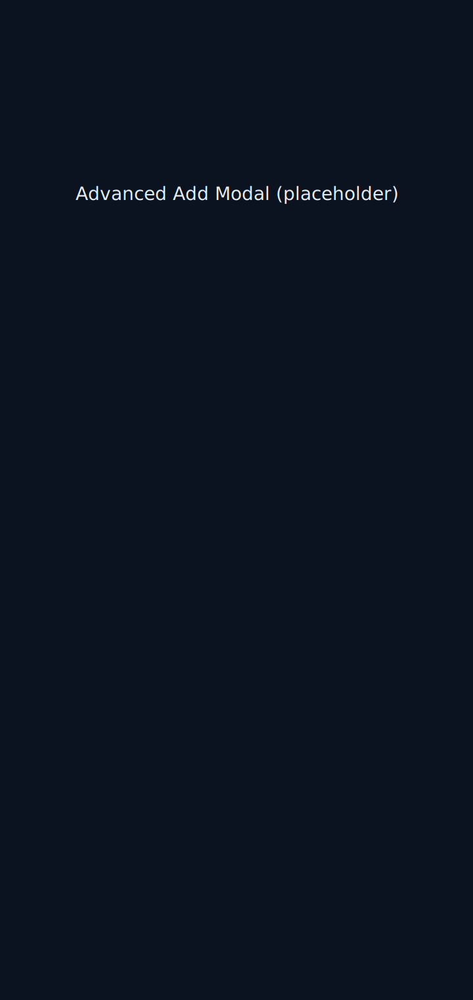
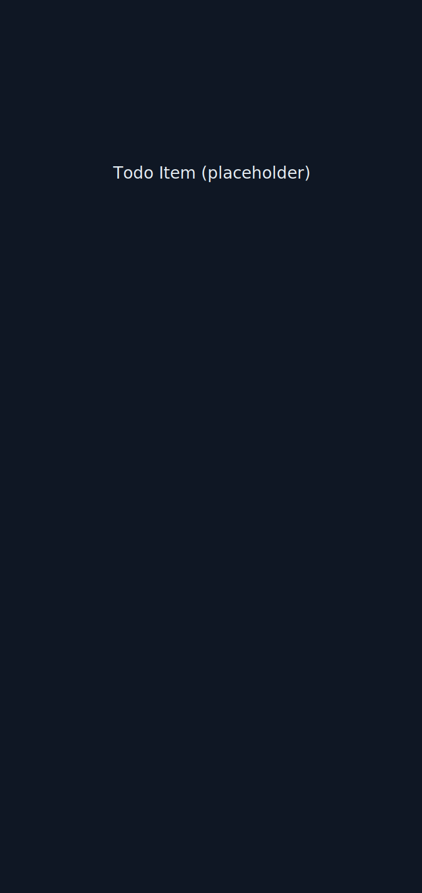

# MyTodoApp

A modern React Native To Do app with categories, due dates, reminders, subtasks, priorities, filters, and a polished UI.

This repository contains a small, self-contained To Do application built with React Native + TypeScript. It focuses on useful productivity features and a clean mobile-first UI.

## Highlights
- Group tasks by category (personal, work, school, other)
- Due dates and time (specify date + time in the advanced add modal)
- Live countdown to due time shown on the task card
- Recurring task metadata (daily, weekly, monthly)
- Priority (low / medium / high)
- Subtasks with per-task progress bar
- Filters, search, and progress tracking
- Modern dark UI with a floating action button (FAB) and an advanced add modal

## Screenshots
Replace the placeholder images in `assets/screenshots/` with actual screenshots from your device/simulator.

Home / List view


Advanced add modal (date/time chooser)


Todo item details (countdown, subtasks, category)


## Quick start
Requirements: Node >= 20, npm, React Native CLI, Xcode (macOS) or Android Studio.

1. Install dependencies

```bash
cd MyTodoApp
npm install
```

2. iOS only: install pods

```bash
cd ios
npx pod-install
cd ..
```

3. Run on iOS simulator

```bash
npm run ios
```

Run on Android

```bash
npm run android
```

4. Run tests

```bash
npm test
```

## File overview
- `App.tsx` — app entry, renders `TodoScreen`
- `src/screens/TodoScreen.tsx` — main UI and list
- `src/components/TodoItem.tsx` — card UI for each todo
- `src/hooks/useTodos.ts` — local todo store + persistence (AsyncStorage)
- `src/components/AdvancedAddModal.tsx` — advanced add modal (date/time, category, priority)
- `__tests__/*` — a small Jest test and AsyncStorage mock

## How to replace screenshots
1. On iOS simulator: press Command+S or use the `xcrun simctl io booted screenshot` command.
2. On Android emulator: use the emulator toolbar or `adb exec-out screencap -p > screen.png`.
3. Save images to `assets/screenshots/` and keep the same filenames or update the README image paths.

## Next steps (suggestions)
- Add local scheduled notifications for due dates (requires native notification library).
- Add persistent category management and color assignment.
- Add remote sync (Supabase/Firebase) for cross-device sync.

If you want, I can: add real screenshots, wire up native pickers or notifications, or build a simple CI workflow.

---
Made with care — enjoy your new To Do app 😄
This is a new [**React Native**](https://reactnative.dev) project, bootstrapped using [`@react-native-community/cli`](https://github.com/react-native-community/cli).

# Getting Started

> **Note**: Make sure you have completed the [Set Up Your Environment](https://reactnative.dev/docs/set-up-your-environment) guide before proceeding.

## Step 1: Start Metro

First, you will need to run **Metro**, the JavaScript build tool for React Native.

To start the Metro dev server, run the following command from the root of your React Native project:

```sh
# Using npm
npm start

# OR using Yarn
yarn start
```

## Step 2: Build and run your app

With Metro running, open a new terminal window/pane from the root of your React Native project, and use one of the following commands to build and run your Android or iOS app:

### Android

```sh
# Using npm
npm run android

# OR using Yarn
yarn android
```

### iOS

For iOS, remember to install CocoaPods dependencies (this only needs to be run on first clone or after updating native deps).

The first time you create a new project, run the Ruby bundler to install CocoaPods itself:

```sh
bundle install
```

Then, and every time you update your native dependencies, run:

```sh
bundle exec pod install
```

For more information, please visit [CocoaPods Getting Started guide](https://guides.cocoapods.org/using/getting-started.html).

```sh
# Using npm
npm run ios

# OR using Yarn
yarn ios
```

If everything is set up correctly, you should see your new app running in the Android Emulator, iOS Simulator, or your connected device.

This is one way to run your app — you can also build it directly from Android Studio or Xcode.

## Step 3: Modify your app

Now that you have successfully run the app, let's make changes!

Open `App.tsx` in your text editor of choice and make some changes. When you save, your app will automatically update and reflect these changes — this is powered by [Fast Refresh](https://reactnative.dev/docs/fast-refresh).

When you want to forcefully reload, for example to reset the state of your app, you can perform a full reload:

- **Android**: Press the <kbd>R</kbd> key twice or select **"Reload"** from the **Dev Menu**, accessed via <kbd>Ctrl</kbd> + <kbd>M</kbd> (Windows/Linux) or <kbd>Cmd ⌘</kbd> + <kbd>M</kbd> (macOS).
- **iOS**: Press <kbd>R</kbd> in iOS Simulator.

## Congratulations! :tada:

You've successfully run and modified your React Native App. :partying_face:

### Now what?

- If you want to add this new React Native code to an existing application, check out the [Integration guide](https://reactnative.dev/docs/integration-with-existing-apps).
- If you're curious to learn more about React Native, check out the [docs](https://reactnative.dev/docs/getting-started).

# Troubleshooting

If you're having issues getting the above steps to work, see the [Troubleshooting](https://reactnative.dev/docs/troubleshooting) page.

# Learn More

To learn more about React Native, take a look at the following resources:

- [React Native Website](https://reactnative.dev) - learn more about React Native.
- [Getting Started](https://reactnative.dev/docs/environment-setup) - an **overview** of React Native and how setup your environment.
- [Learn the Basics](https://reactnative.dev/docs/getting-started) - a **guided tour** of the React Native **basics**.
- [Blog](https://reactnative.dev/blog) - read the latest official React Native **Blog** posts.
- [`@facebook/react-native`](https://github.com/facebook/react-native) - the Open Source; GitHub **repository** for React Native.
