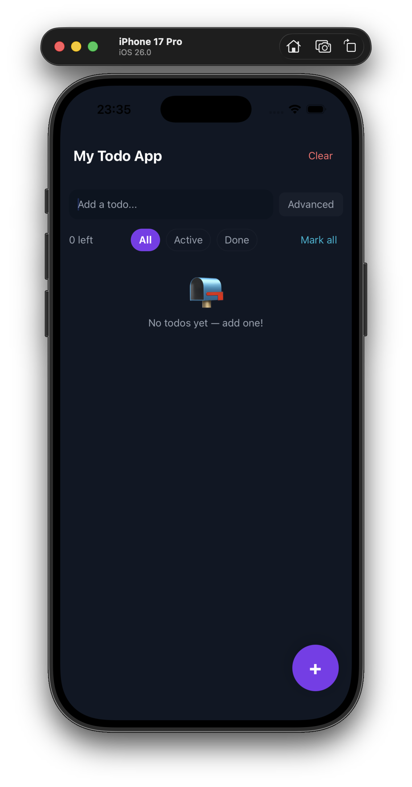
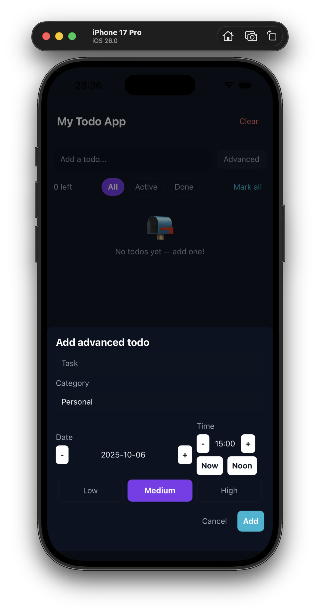

# MyTodoApp

Hello! This is a modern React Native To Do app with categories, due dates, reminders, subtasks, priorities, filters, and a polished UI.

This repository contains a small, self-contained To Do application built with React Native + TypeScript. It focuses on useful productivity features and a clean mobile-first UI.

## Highlights
- Group tasks by category (personal, work, school, other)
- Due dates and time (specify date + time in the advanced add modal)
- Live countdown to due time shown on the task card
- Recurring task metadata (daily, weekly, monthly)
- Priority (low / medium / high)
- Subtasks with per-task progress bar
- Filters, search, and progress tracking
- Modern dark UI with a floating action button (FAB) and an advanced add modal

## Screenshots

Home / List view and Advanced add modal shown side-by-side below. 

<div align="center">
	
	
</div>

## Quick start
Requirements: Node >= 20, npm, React Native CLI, Xcode (macOS) or Android Studio.

1. Install dependencies

```bash
cd MyTodoApp
npm install
```

2. iOS only: install pods

```bash
cd ios
npx pod-install
cd ..
```

3. Run on iOS simulator

```bash
npm run ios
```

Run on Android

```bash
npm run android
```

4. Run tests

```bash
npm test
```

## File overview
- `App.tsx` — app entry, renders `TodoScreen`
- `src/screens/TodoScreen.tsx` — main UI and list
- `src/components/TodoItem.tsx` — card UI for each todo
- `src/hooks/useTodos.ts` — local todo store + persistence (AsyncStorage)
- `src/components/AdvancedAddModal.tsx` — advanced add modal (date/time, category, priority)
- `__tests__/*` — a small Jest test and AsyncStorage mock

## How to replace screenshots
1. On iOS simulator: press Command+S or use the `xcrun simctl io booted screenshot` command.
2. On Android emulator: use the emulator toolbar or `adb exec-out screencap -p > screen.png`.
3. Save images to `assets/screenshots/` and keep the same filenames or update the README image paths.

## Next steps (suggestions)
- Add local scheduled notifications for due dates (requires native notification library).
- Add persistent category management and color assignment.
- Add remote sync (Supabase/Firebase) for cross-device sync.

---
Made with care — enjoy your new To Do app 😄
This is a new [**React Native**](https://reactnative.dev) project, bootstrapped using [`@react-native-community/cli`](https://github.com/react-native-community/cli).
